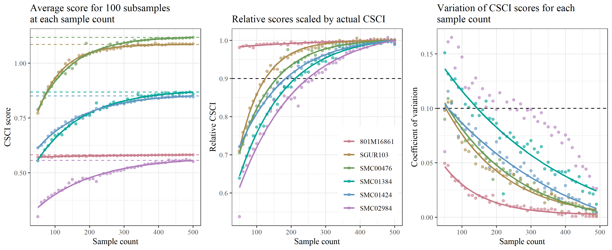
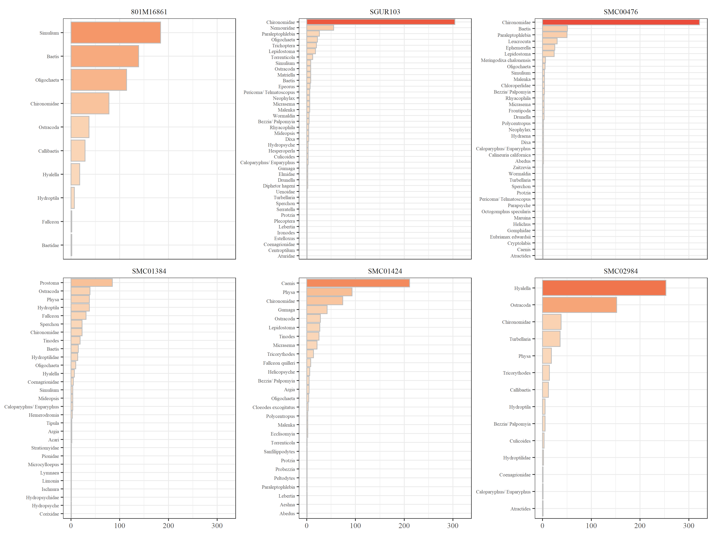

For the set of codes that numbered, no need to run simulating data function
Those simulations are in the stations folder.

Results: [https://sccwrp.github.io/simulation_CSCI/Rmarkdown/CSCI_sample.html](https://sccwrp.github.io/simulation_CSCI/Rmarkdown/CSCI_sample.html)

