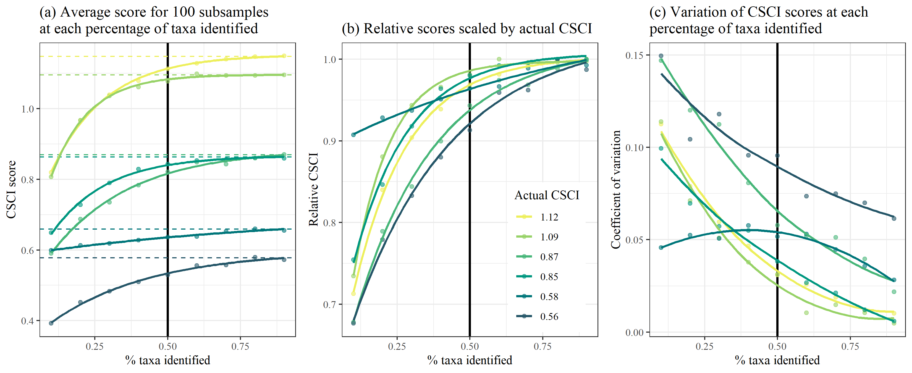

# README

#### Quynh-Thi Ho, Marcus Beck

Analysis code for evaluating effects of changing sample count and taxa ambiguity on CSCI scores

Results: [https://sccwrp.github.io/simulation_CSCI/Rmarkdown/CSCI_sample.html](https://sccwrp.github.io/simulation_CSCI/Rmarkdown/CSCI_sample.html)

